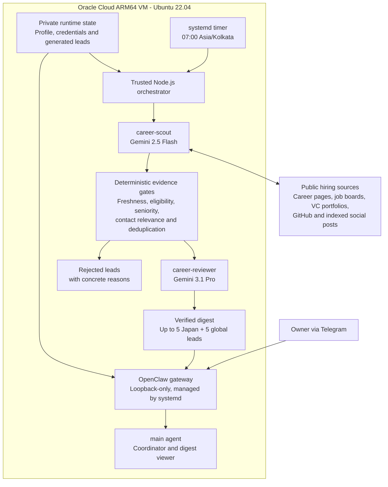

# Open Claw Lab

An Oracle Cloud-hosted, multi-agent career intelligence system built and
operated by [Sankalp Jha](https://sankalpjha.dev/).

I built this lab to find high-signal engineering opportunities that ordinary
job alerts often miss: early-stage startups, freshly funded teams, public
hiring posts, and companies open to candidates from India. The search gives
special attention to Japan, while also covering worldwide remote roles and
onsite roles with explicit relocation or visa support.

This repository is a sanitized showcase of the live setup. It demonstrates the
agent architecture, deterministic validation, security boundaries, deployment
units, synthetic tests, and operational workflow. Credentials, personal
profile data, generated leads, sessions, and message history remain private on
the server.

## System Architecture



## Agent Roles

| Component | Responsibility | Capability boundary |
| --- | --- | --- |
| `main` | Telegram-facing coordinator and verified-digest viewer | Can communicate with the approved owner and read public research; cannot execute shell commands or inspect credentials |
| `career-scout` | Discovers hiring signals and produces structured candidate records | Public web search and fetch only; no messaging, browser automation, filesystem access, or command execution |
| `career-reviewer` | Independently cross-checks every surviving claim and source | Public web verification only; cannot alter runtime state or contact anyone |
| Node.js orchestrator | Runs the agents, validation stages, reporting, and delivery in a predictable order | Trusted host process with a narrow systemd sandbox and private output directory |

Separating discovery from review is intentional. The scout is optimized for
recall, while the reviewer and deterministic rules protect precision. An agent
cannot approve its own unsupported claim.

## Evidence-Gated Pipeline

1. The scout searches official job boards, company career pages, VC portfolio
   pages, YC, Wellfound, Hacker News, public GitHub activity, and publicly
   indexed LinkedIn or X posts.
2. Every lead is normalized to the schema in
   [`schemas/lead.schema.json`](schemas/lead.schema.json).
3. Code rejects stale posts, unsupported geography, senior-only mismatches,
   irrelevant contacts, unverifiable relocation claims, and duplicates.
4. The reviewer reopens the cited evidence and independently returns a verdict.
5. Only verified leads enter the Telegram digest. Quality takes priority over
   filling the ten-result target.

The contact policy is deliberately strict:

- Remote roles must explicitly accept India, worldwide applicants, or a
  compatible region.
- Onsite roles outside India need explicit visa, relocation, or funded mobility
  evidence.
- Recruiters, talent partners, Heads of People, and relevant hiring managers are
  preferred.
- Founders or CTOs qualify only for small startups with a current hiring signal.
- An email is shown only when the exact address is publicly visible at the cited
  URL. Guessed patterns, catch-all addresses, and inferred addresses are rejected.
- The system never sends an email, applies to a role, or contacts a person
  automatically.

## Why I Rebuilt It

The first version relied too heavily on free-form agent output. Failed searches
could turn into plausible-looking but invented email addresses, and a removed
CLI command left scheduled scans silently failing. I rebuilt the workflow around
typed records, independent review, deterministic rejection rules, observable
systemd jobs, and least-privilege agent policies.

That evolution is the main engineering story of this project: LLM output is
treated as untrusted input, evidence is part of the data model, and automation
stops when confidence is insufficient.

## Deployment And Security

The live lab runs under a dedicated `openclaw` Linux account on an Oracle Cloud
ARM64 instance with Ubuntu 22.04, Node.js 22, and OpenClaw 2026.7.x.

- The gateway is supervised by systemd and bound to `127.0.0.1:18789`.
- Its dashboard is reached through an SSH tunnel, not exposed directly to the
  internet.
- Telegram access is restricted to an explicit owner allowlist; group access is
  disabled.
- Agent tool policies deny command execution, elevated tools, arbitrary file
  access, and direct outreach.
- Provider and Telegram credentials use runtime secret references and are never
  stored in this repository.
- Gmail credentials and sending scripts are outside the agents' capability
  boundary.
- The daily timer is enabled only after a dry canary passes source inspection.

Reusable service units and recovery steps are documented in
[`docs/OPERATIONS.md`](docs/OPERATIONS.md).

## Repository Map

| Path | What it shows |
| --- | --- |
| [`config/openclaw.example.json`](config/openclaw.example.json) | Sanitized multi-agent and gateway configuration |
| [`workspaces/`](workspaces) | Minimal scout and reviewer identities, policies, and skills |
| [`prompts/`](prompts) | Structured discovery and independent-review contracts |
| [`scripts/run-pipeline.mjs`](scripts/run-pipeline.mjs) | Trusted orchestration entry point |
| [`src/validation.mjs`](src/validation.mjs) | Deterministic acceptance, rejection, and deduplication rules |
| [`deploy/systemd/`](deploy/systemd) | Hardened gateway, pipeline service, and daily timer units |
| [`fixtures/raw-leads.json`](fixtures/raw-leads.json) | Synthetic leads for repeatable demonstrations |
| [`test/`](test) | Security, migration, validation, and privacy regression tests |

## Verify The Showcase

The included fixture run uses synthetic data and does not need credentials or
send Telegram messages.

```bash
npm test
npm run dry-run
npm run secret-scan
```

Expected behavior includes accepting evidence-backed Japan and global leads,
while rejecting guessed emails, stale signals, unsupported relocation, wrong
contact roles, India-ineligible remote roles, and duplicates.

## Public And Private Boundary

This public repository contains reusable infrastructure, templates, and
synthetic fixtures only. Real OpenClaw configuration, API keys, OAuth and
Telegram credentials, sessions, logs, private career history, generated leads,
and contact lists are intentionally excluded.

Built by **Sankalp Jha**: [portfolio](https://sankalpjha.dev/) ·
[GitHub](https://github.com/blackdragoon26) ·
[LinkedIn](https://www.linkedin.com/in/sankalp-jha-18a95a244/)
